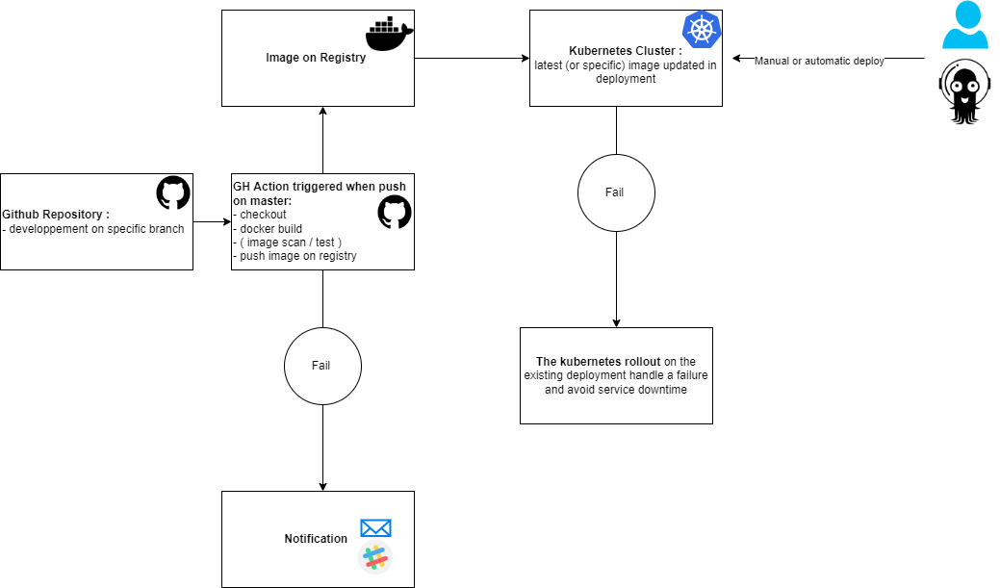

# Deployment procedure for instant-search-demo

The automated deployment of the instant-search-demo code is based on:

-  **Github Action** to automatically build a **docker image** and push it to a registry
-  A **Kubernetes** cluster to deploy the application using rollout mecanism



## Integration : 

### Releasing the application

The application should be developped on at least one specific developpement branch, maybe features branch or hotfix branches. 

After a pipeline of linting, reviewing, testing the code,  the release can be merged on the master branch.    


### Preriquisites on the source code repository 

Auto build and push is achieved via **github action** when a commit is pushed on the master branch of the repository :
https://github.com/antgilles/instant-search-demo
  
  
```
  name: Docker Image CI

on:
  push:
    branches: [ "master" ]
    
jobs:
  build:
    runs-on: ubuntu-latest
    steps:
    - uses: actions/checkout@v3
    - name: Build the Docker image
      run: docker build . --file Dockerfile --tag antgilles/algassignement:$(echo $GITHUB_SHA | cut -c 1-6) && docker tag antgilles/algassignement:$(echo $GITHUB_SHA | cut -c 1-6) docker tag antgilles/algassignement:latest
    - name: Login on DockerHub
      run: docker login -u antgilles -p ${{ secrets.GH_PASS }}
    - name: Push on DockerHub
      run: docker push antgilles/algassignement:$(echo $GITHUB_SHA | cut -c 1-6) && docker push antgilles/algassignement:latest
```

> Usage of github action secret to login and push image on Docker Hub

> Image could be pushed on any other private or public registry 

TODO : use github tag release if available in order to tag the docker image rather than commit sha. 

Here is is the Dockerfile used for image building :

```
FROM node:9

#create app directory
WORKDIR /usr/src/app

# Install app dependencies
# A wildcard is used to ensure both package.json AND package-lock.json are copied
# where available (npm@5+)
COPY package*.json ./

RUN npm install
# If you are building your code for production
# RUN npm ci --only=production

# Bundle app source
COPY . .

EXPOSE 3000
CMD [ "npm", "start" ]
```

The github Action could launch specific test or image vulnerability scanning to complete CI before pushing the image. 

If the build/test fails (or successes) notifications should be sent ( defaul is mail to the repo owner ) 

## Kubernetes deployment

### Try it locally with minikube

If you don't have a working k8s cluster, try the procedure locally with **minikube** 

- [Install kubectl](https://kubernetes.io/fr/docs/tasks/tools/install-kubectl/#install-kubectl-on-linux)

- [Install Minikube ](https://kubernetes.io/fr/docs/tasks/tools/install-minikube/)

###  K8S resources creation :

> All the command below are run in the default namespace, adapt to your needs

- We need at least a **deployment** of one (or more) pod with the docker image built during the automatic CI Phase.

```
apiVersion: apps/v1
kind: Deployment
metadata:
  name: instant-search-deployment
  labels:
    app: instant-search
spec:
  replicas: 2
  selector:
    matchLabels:
      app: instant-search
  template:
    metadata:
      labels:
        app: instant-search
    spec:
      containers:
      - name: instant-search
        image: antgilles/algassignement:latest
        ports:
        - containerPort: 3000

```
```
kubectl apply -f https://raw.githubusercontent.com/antgilles/algassignement/main/deploy-instant-search.yaml 
```

Check the newly created deployment
```
kubectl get deploy 
NAME                        READY   UP-TO-DATE   AVAILABLE   AGE
instant-search-deployment   2/2     2            2           35s

```

Check the pods associated to the current replicaset created by the deployment
```
kubectl get po 
NAME                                         READY   STATUS    RESTARTS   AGE
instant-search-deployment-758f75b46c-2cnf4   1/1     Running   0          40s
instant-search-deployment-758f75b46c-mq8lh   1/1     Running   0          38s

```

- And we need a **service** to expose our application 

```
apiVersion: v1
kind: Service
metadata:
  name: instant-search-service
spec:
  selector:
    app: instant-search
  ports:
    - protocol: TCP
      port: 80
      targetPort: 3000
  type: NodePort

```
```
kubectl apply -f  https://raw.githubusercontent.com/antgilles/algassignement/main/service-instant-search.yaml
```

Check the newly created Service
```
kubectl get service
NAME                     TYPE        CLUSTER-IP       EXTERNAL-IP   PORT(S)        AGE
instant-search-service   NodePort    10.110.113.188   <none>        80:31208/TCP   18s
```

> It could be a good idea to put an ingress in front of our service to serve client requests 


To test the application with minkube you can get the mapped url of the service :
```
minikube service instant-search-service
|-----------|------------------------|-------------|---------------------------|
| NAMESPACE |          NAME          | TARGET PORT |            URL            |
|-----------|------------------------|-------------|---------------------------|
| default   | instant-search-service |          80 | http://192.168.49.2:31208 |
|-----------|------------------------|-------------|---------------------------|

```

You can open it in  a local browser or use a tunnel.

```
curl -i http://192.168.49.2:31208
HTTP/1.1 200 OK
Accept-Ranges: bytes
Cache-Control: public, max-age=0
Last-Modified: Fri, 08 Jul 2022 16:18:30 GMT
ETag: W/"d1b-181de9b03f0"
Content-Type: text/html; charset=UTF-8
Content-Length: 3355
Date: Fri, 08 Jul 2022 16:51:08 GMT
Connection: keep-alive

<!doctype html>
<html>
<head>
  <title>Instant Search Tutorial</title>
```

## Process to Update existing deployment

If a new version of application is released on master branch, a new docker image is automatically built and tagged "latest".

Since our deployement call the latest tag, we only have to rollout on the new latest tag.

```
kubectl rollout restart deploy/instant-search-deployment
deployment.apps/instant-search-deployment restarted
```

A second replicaset is created for the deployement
```
ubuntu@ip-172-31-2-203:~$kubectl get replicaset
NAME                                   DESIRED   CURRENT   READY   AGE
instant-search-deployment-7c77b84cf4   1         1         0       3s
instant-search-deployment-7cd6ff8565   2         2         2       3d
ubuntu@ip-172-31-2-203:~$ kubectl get replicaset
NAME                                   DESIRED   CURRENT   READY   AGE
instant-search-deployment-7c77b84cf4   1         1         0       8s
instant-search-deployment-7cd6ff8565   2         2         2       3d
ubuntu@ip-172-31-2-203:~$ kubectl get replicaset
NAME                                   DESIRED   CURRENT   READY   AGE
instant-search-deployment-7c77b84cf4   2         2         1       12s
instant-search-deployment-7cd6ff8565   1         1         1       3d
ubuntu@ip-172-31-2-203:~$ kubectl get replicaset
NAME                                   DESIRED   CURRENT   READY   AGE
instant-search-deployment-7c77b84cf4   2         2         2       15s
instant-search-deployment-7cd6ff8565   0         0         0       3d
```

At the end the rollout is total without any downtime. 

```
ubuntu@ip-172-31-2-203:~$ kubectl rollout status deploy/instant-search-deployment
deployment "instant-search-deployment" successfully rolled out
```

> We could add readiness and liveness probes in the pod to be sure the service is  totally working before sending traffic on the pod.

If we want to rollback on  specific image version we can update image in the deployment :
```
kubectl set image deployment/instant-search-deployment  instant-search=antgilles/algassignement:8afc5f
```
